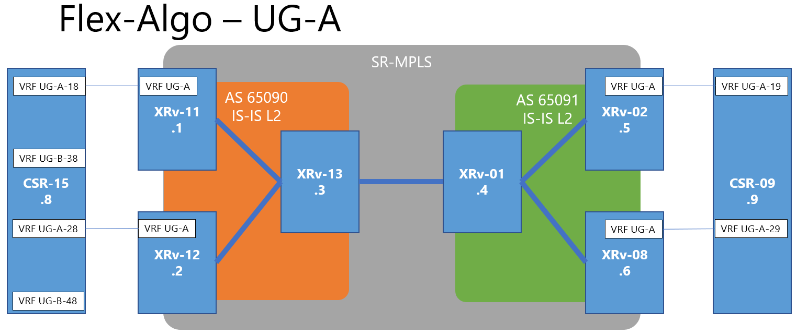
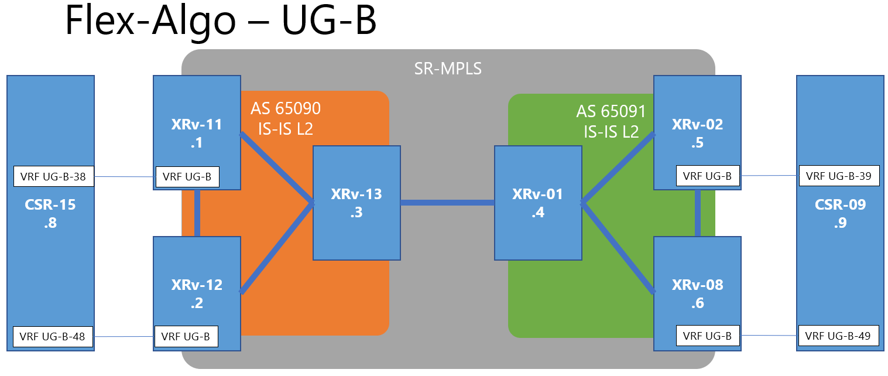
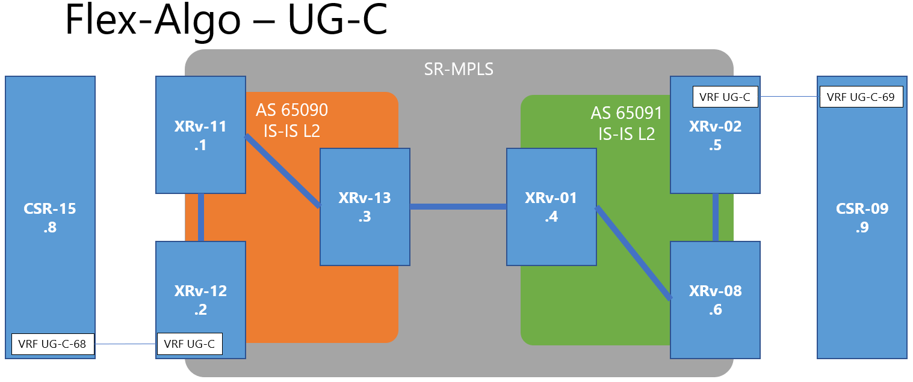

# Flex-Algo for SR-MPLS

SR-MPLSの醍醐味の一つとして、Flex-Algoがあったため、導入してみた \
、、、が、うまくいっていない結果となってしまっている。\
現時点の状況をここに記載する。

Related to the issue [#5](../../../issues/5)

## Flex-Algo とは？
Segment-Rougingが動作している区間について、仮想的に分離し、ポリシーに応じたTraffic Engineering (TE) が適用できるようにする技術。\
従来のTEが基本的に全ルートを最短パス以外を通るようにしていたが、トラフィックの特性に応じた経路のチューニングができるようになる。

## Flex-Algo Topology
- Flex-Algo ID: 
  - UG-A: 128
  - UG-B: 129
  - UG-C: 130
- Flex-Algo Node SID (16000 + index):
  - UG-A: 1628x
  - UG-B: 1629x
  - UG-C: 1630x

### Flex-Algo UG-A

### Flex-Algo UG-B

### Flex-Algo UG-C
最短経路を通らず、迂回する経路を選択する

## 設計詳細
参考URL: [Enabling Segment Routing Flexible Algorithm](https://www.cisco.com/c/en/us/td/docs/routers/asr9000/software/asr9k-r6-6/segment-routing/configuration/guide/b-segment-routing-cg-asr9000-66x/b-segment-routing-cg-asr9000-66x_chapter_01111.html)\
参考URL: [SR IGP Flex-Algo](https://www.segment-routing.net/images/sr-igp-flex-algo-rev4b-km1.pdf)\
参考URL: [Segment Routing Part II: Traffic Engineering](http://reader.epubee.com/books/mobile/ca/cacd5c24169cf915c7991980790aab66/text00010.html)

