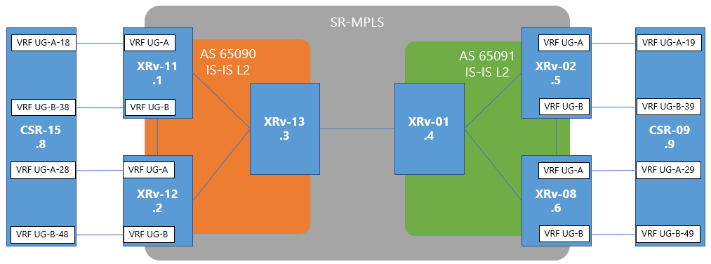
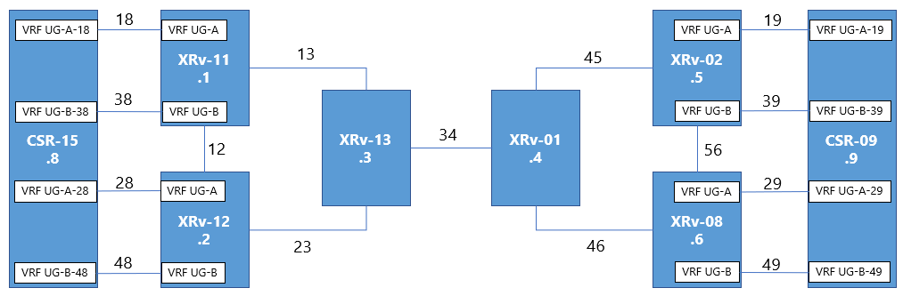
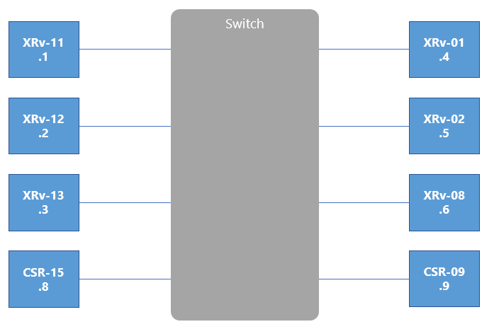

# SR-MPLS Multi AS MP-BGP Practice
Practice repository - Upload the config to work.\
This is Backbone network with SR-MPLS which has multi AS for MP-BGP, and CE routers will be pingable from each edge. 

SR-MPLS をベースにしたバックボーン環境を構築する。MP-BGPはマルチASとし、異なるASを接続した通信を実装する。

## 前提条件
Cisco 製品では、現時点でSRに対応しているのはCisco IOS XRのみ。\
VMの上の仮想環境で構築する。
* PE routers & P routers: Cisco XRv
* CE routers: Cisco CSR 1000v

## Network diagram
### Layer 3 IP assignment
* Inner-AS: ```192.168.xx.xx/24```
  * Octet 3: Link ID
* Inter-AS: ```172.24.xx.xx/24```
  * Octet 3: Link ID
* Mgmt IP: ```100.64.x.x/32```
  * Octet 3: 
    * UG-A: ```10```
    * UG-B: ```20```
* UG AS: ```650xx```



### Layer 2.8 Segment Routing ID assignment
* SRGB Range: ```16000 - 23999```
  * Segment ID: ```1600x```


### Layer 2 VLAN assignment
クラウド上に構築するため、リソース節約のため、単一物理ネットワーク上に構築する。\
ルータ間接続はVLANで接続し、他の通信が干渉しないようにする。



### Layer 1 Physical port assignment
リソース節約のため、単一物理ネットワーク上に構築する。\
L1レベルではすべて同じスイッチに所属しているように見える。



## 設計詳細

* 参考URL: [IOS および IOS XR を使用したレイヤ 3 MPLS VPN INTER-AS オプション B の設定と検証](https://www.cisco.com/c/ja_jp/support/docs/multiprotocol-label-switching-mpls/mpls/200557-Configuration-and-Verification-of-Layer.html)
* 参考URL: [MPLS網にSegment Routingを適用してみよう](https://www.netone.co.jp/knowledge-center/blog-column/knowledge_takumi_175/)
* 参考URL: [Segment Routing Configuration Guide for Cisco ASR 9000 Series Routers, IOS XR](https://www.cisco.com/c/en/us/td/docs/routers/asr9000/software/segment-routing/configuration/guide/b-seg-routing-cg-asr9k.html)
* 参考URL: [SR IGP Flex Algo - Segment Routing](https://www.segment-routing.net/images/sr-igp-flex-algo-rev4b-km1.pdf)
* 参考URL: [Segment Routingでよく聞かれること](https://note.com/ka_summary/n/n6ba56050774f)


### Segment Routing のとは？

### Segment Routing のメリット

Benefits
* Ready for SDN: Segment routing was built for SDN and is the foundation for Application Engineered Routing (AER). SR prepares networks for business models, where applications can direct network behavior. SR provides the right balance between distributed intelligence and centralized optimization and programming.
* Minimal configuration: Segment routing for TE requires minimal configuration on the source router.
* Load balancing: Unlike in RSVP-TE, load balancing for segment routing can take place in the presence of equal cost multiple paths (ECMPs).
* Supports Fast Reroute (FRR): Fast reroute enables the activation of a pre-configured backup path within 50 milliseconds of path failure.
* Plug-and-Play deployment: Segment routing tunnels are interoperable with existing MPLS control and data planes and can be implemented in an existing deployment.


### SR-MPLS の基本設定とIGP
* 参考URL: [MPLS網にSegment Routingを適用してみよう](https://www.netone.co.jp/knowledge-center/blog-column/knowledge_takumi_175/)
* 参考URL: [Segment Routing Configuration Guide for Cisco ASR 9000 Series Routers, IOS XR](https://www.cisco.com/c/en/us/td/docs/routers/asr9000/software/segment-routing/configuration/guide/b-seg-routing-cg-asr9k.html)

#### IGPの選択
IS-ISとOSPFが対応。本環境ではFlex-Algo利用を視野に入れていることもあり、Segment Routingが早期から導入されてきたIS-ISを利用する。\
IS-ISのため、NSAPアドレスの設定が必要なので、忘れずに設定する。\
本環境ではNSAPアドレスはLoopbackアドレス、アドレスファミリーはIPv4を用いる。

```
router isis core
 net 49.0001.1000.6400.0001.00
 address-family ipv4 unicast
  segment-routing mpls
```

#### SRGBの設定
マルチベンダー環境の場合、Segment Routing Global Block (SRGB) の規定値が異なる場合があるので、念のためで設定を投入することが推奨。\
SRGBはルータ内でPrefix-sid / Node-sid 等のGlobal SID付与に使用されるラベル番号の範囲のこと。\
Ciscoのデフォルトは```16000 - 23999```

```
router isis core
 segment-routing global-block 16000 23999
```

#### Node SID設定
SRGBの範囲内で機器にNode Segment IDを付与。Node-sidはルータ自身を示すSIDであり同一SR Domain内でユニーク（一意）である必要あり。\
通常、Loopback インターフェースにてIS-ISを動作させ、Node SIDを割り当てている。\
指定方法にはindex指定と絶対値(absolute)指定の2種類存在。index指定が一般的。\
indexはSRGBの開始値に加算した値がNode-SIDとなる。

```
router isis core
 interface Loopback1
  passive
  address-family ipv4 unicast
   prefix-sid index 1001
```

(参考) SRGBの開始値が16000の時、下記2つの設定は同一。
```
   prefix-sid index 1001
   prefix-sid absolute 17001
```

#### Adjacency-SID設定
Adj-sidはユーザが設定する必要は無く自動的に付与されるが、自身で設定する場合には下記\
Cisco デフォルトの SRLB は ```15000 - 15999``` のため、index指定の場合はSRGB同様、SRLB開始値に加算される。

```
router isis core
 segment-routing global-block 16000 23999
 !
 interface GigabitEthernet0/0/0/0.12
  point-to-point
  address-family ipv4 unicast
   adjacency-sid index 12
  !
 !
 interface GigabitEthernet0/0/0/0.13
  point-to-point
  address-family ipv4 unicast
   adjacency-sid index 13
  !
segment-routing
 global-block 16000 23999
 adjacency-sid
  interface GigabitEthernet0/0/0/0.12
   address-family ipv4 unicast
    l2-adjacency-sid absolute 15012 next-hop 192.168.12.2
   !
  !
  interface GigabitEthernet0/0/0/0.13
   address-family ipv4 unicast
    l2-adjacency-sid absolute 15013 next-hop 192.168.13.3
```

#### TI-LFA設定
SR環境でFRR（Fast ReRoute : 高速迂回）を実現するための機能であるTI-LFA（Topology Independent Loop Free Alternate）の設定を実施。\
TI-LFAを使用するとルータは最適pathとは異なる迂回用のpathをprefix毎に計算し、それを保持。\
最適pathの障害時には保持している迂回用pathに通信を切り替えることで高速迂回を実現。


```
router isis core
 interface GigabitEthernet0/0/0/0.12
  address-family ipv4 unicast
   fast-reroute per-prefix
   fast-reroute per-prefix ti-lfa
  !
 !
 interface GigabitEthernet0/0/0/0.13
  address-family ipv4 unicast
   fast-reroute per-prefix
   fast-reroute per-prefix ti-lfa
```

#### Overlay MP-BGP - iBGP 設定
基本的にはMPLSと特に設定差分は存在しない。\
VRF上のユーザプレフィックスを伝搬するのはVPNv4アドレスファミリーなので、必ず設定する。\
また、Route-Reflectorとして動作させる機器には```route-reflector-client```も設定する。

```
router bgp 65090
 bgp router-id 100.64.0.1
 address-family ipv4 unicast
 address-family vpnv4 unicast
 !
neighbor 100.64.0.2
  remote-as 65090
  update-source Loopback1
  address-family ipv4 unicast
   next-hop-self
   soft-reconfiguration inbound always
  address-family ipv4 labeled-unicast
  address-family vpnv4 unicast
   next-hop-self
   soft-reconfiguration inbound always
```

#### Overlay MP-BGP - eBGP + VRF 設定
基本的にはMPLSと特に設定差分は存在しない。\
XRvの制約として、eBGPにroute-policy適用が必須となっているので注意。

```
vrf UG-A
 rd 100.64.10.1:10
 address-family ipv4 unicast
  import route-target
   89:10
  !
  export route-target
   89:10
router bgp 65090
 vrf UG-A
  address-family ipv4 unicast
   redistribute connected
  !
  neighbor 172.24.18.8
   remote-as 65018
   address-family ipv4 unicast
    route-policy PERMIT-ALL-IN in
    route-policy PERMIT-ALL-OUT out
    soft-reconfiguration inbound always
```


### Segment Routing 環境での Inter AS MP-BGP
基本的にはMPLSと特に設定差分は存在しない。\
XRvの制約として、eBGPピア向けのStaticが必須となっているので注意。（バグか？）

```
router static
 address-family ipv4 unicast
  172.24.34.4/32 GigabitEthernet0/0/0/0.34
 !
router bgp 65090
 neighbor 172.24.34.4
 remote-as 65091
 address-family vpnv4 unicast
 route-policy DEFAULT in
 route-policy DEFAULT out
```

### SR-MPLSの状態確認

#### ルーティングテーブル
TI-LFAが有効化されているため、IGP部分については2行表示されている。

```
i L1 100.64.0.2/32 [115/10] via 192.168.12.2, 05:42:41, GigabitEthernet0/0/0/0.12
                   [115/20] via 192.168.13.3, 05:42:41, GigabitEthernet0/0/0/0.13 (!)
i L1 100.64.0.3/32 [115/20] via 192.168.12.2, 05:42:41, GigabitEthernet0/0/0/0.12 (!)
                   [115/10] via 192.168.13.3, 05:42:41, GigabitEthernet0/0/0/0.13
```

#### LFIBテーブル
```SR Pfx (idx 1002)```の部分が他のNode SID。\
一部、Flex-Algoの設定箇所についてNode-SIDやSR-TEのラベルが増えている。

```
RP/0/RP0/CPU0:cisco-kudo-11#show mpls forwarding

Wed Dec 30 08:19:22.230 UTC
Local  Outgoing    Prefix             Outgoing     Next Hop        Bytes       
Label  Label       or ID              Interface                    Switched    
------ ----------- ------------------ ------------ --------------- ------------
15012  Pop         SRLB (idx 12)      Gi0/0/0/0.12 192.168.12.2    0           
15013  Pop         SRLB (idx 13)      Gi0/0/0/0.13 192.168.13.3    0           
16281  16281       SR Pfx (idx 281)   Gi0/0/0/0.13 192.168.13.3    0           
16282  16282       SR Pfx (idx 282)   Gi0/0/0/0.13 192.168.13.3    0           
16283  Pop         SR Pfx (idx 283)   Gi0/0/0/0.13 192.168.13.3    0           
16291  16291       SR Pfx (idx 291)   Gi0/0/0/0.13 192.168.13.3    0           
       16291       SR Pfx (idx 291)   Gi0/0/0/0.12 192.168.12.2    0           
16292  Pop         SR Pfx (idx 292)   Gi0/0/0/0.12 192.168.12.2    0           
       16292       SR Pfx (idx 292)   Gi0/0/0/0.13 192.168.13.3    0            (!)
16293  Pop         SR Pfx (idx 293)   Gi0/0/0/0.13 192.168.13.3    0           
       16293       SR Pfx (idx 293)   Gi0/0/0/0.12 192.168.12.2    0            (!)
16301  16301       SR Pfx (idx 301)   Gi0/0/0/0.13 192.168.13.3    0           
       16301       SR Pfx (idx 301)   Gi0/0/0/0.12 192.168.12.2    0           
16302  Pop         SR Pfx (idx 302)   Gi0/0/0/0.12 192.168.12.2    0           
16303  Pop         SR Pfx (idx 303)   Gi0/0/0/0.13 192.168.13.3    0           
17002  Pop         SR Pfx (idx 1002)  Gi0/0/0/0.12 192.168.12.2    11614       
       17002       SR Pfx (idx 1002)  Gi0/0/0/0.13 192.168.13.3    0            (!)
17003  Pop         SR Pfx (idx 1003)  Gi0/0/0/0.13 192.168.13.3    15455       
       17003       SR Pfx (idx 1003)  Gi0/0/0/0.12 192.168.12.2    0            (!)
24000  Pop         SR Adj (idx 0)     Gi0/0/0/0.13 192.168.13.3    0           
       17003       SR Adj (idx 0)     Gi0/0/0/0.12 192.168.12.2    0            (!)
24001  Pop         SR Adj (idx 2)     Gi0/0/0/0.13 192.168.13.3    0           
24002  Pop         SR Adj (idx 1)     Gi0/0/0/0.13 192.168.13.3    0           
       17003       SR Adj (idx 1)     Gi0/0/0/0.12 192.168.12.2    0            (!)
24003  Pop         SR Adj (idx 3)     Gi0/0/0/0.13 192.168.13.3    0           
24004  Pop         SR Adj (idx 0)     Gi0/0/0/0.12 192.168.12.2    0           
       17002       SR Adj (idx 0)     Gi0/0/0/0.13 192.168.13.3    0            (!)
24005  Pop         SR Adj (idx 2)     Gi0/0/0/0.12 192.168.12.2    0           
24006  Pop         SR Adj (idx 1)     Gi0/0/0/0.12 192.168.12.2    0           
       17002       SR Adj (idx 1)     Gi0/0/0/0.13 192.168.13.3    0            (!)
24007  Pop         SR Adj (idx 3)     Gi0/0/0/0.12 192.168.12.2    0           
24008  Pop         192.168.23.0/24    Gi0/0/0/0.12 192.168.12.2    0           
       Pop         192.168.23.0/24    Gi0/0/0/0.13 192.168.13.3    0           
24009  Pop         100.64.0.3/32      Gi0/0/0/0.13 192.168.13.3    158723      
       24009       100.64.0.3/32      Gi0/0/0/0.12 192.168.12.2    0            (!)
24010  Pop         100.64.0.2/32      Gi0/0/0/0.12 192.168.12.2    151294      
       24009       100.64.0.2/32      Gi0/0/0/0.13 192.168.13.3    0            (!)
24011  Aggregate   UG-A: Per-VRF Aggr[V]   \
                                      UG-A                         1020        
24012  24012       100.64.10.3/32[V]               100.64.0.3      0           
24020  Aggregate   UG-B: Per-VRF Aggr[V]   \
                                      UG-B                         0           
24021  24012       100.64.10.2/32[V]               100.64.0.2      0           
24022  24012       172.24.28.0/24[V]               100.64.0.2      0           
24025  Pop         No ID              srte_c_128_e point2point     0           
24026  Pop         No ID              srte_c_130_e point2point     0           
24027  Pop         SR TE: 1 [TE-INT]  Gi0/0/0/0.13 192.168.13.3    0           
24028  Pop         SR TE: 2 [TE-INT]  Gi0/0/0/0.13 192.168.13.3    0           
24029  Unlabelled  100.64.10.18/32[V] Gi0/0/0/0.18 172.24.18.8     0           
24030  Unlabelled  100.64.20.38/32[V] Gi0/0/0/0.38 172.24.38.8     0           
24031  24030       100.64.10.28/32[V]              100.64.0.2      0           
```


### SRv6 の基本設定
* 参考URL: [Segment Routing Configuration Guide for Cisco ASR 9000 Series Routers, IOS XR Release 6.6.x](https://www.cisco.com/c/en/us/td/docs/routers/asr9000/software/asr9k-r6-6/segment-routing/configuration/guide/b-segment-routing-cg-asr9000-66x/b-segment-routing-cg-asr9000-66x_chapter_011.html)

#### Locatorの設定
SRv6のノードを指し示す、Locator と Node SID を設定\
ついでに、カプセル化する送信元アドレスも設定（任意）\
合わせて、Locatorのステータス変更のログを取得（任意）

```
segment-routing
 srv6
  logging locator status
  encapsulation
   source-address fd00:5:5::5
  !
  locators
   locator No5
    prefix fd00:5:5::/64
```

#### IGPの設定
IS-ISとOSPFv3の両方が利用可能。\
今回はSR-MPLSと同様にIS-ISを利用する。\
IPv6環境の上に構築するため、アドレスファミリーはIPv6のみで十分。

```
router isis core
 net 49.0001.1000.6400.0005.00
 distribute link-state
 address-family ipv6 unicast
  segment-routing srv6
   locator No5
 interface Loopback5
  passive
  address-family ipv6 unicast
 interface GigabitEthernet0/0/0/0.45
  address-family ipv6 unicast
 interface GigabitEthernet0/0/0/0.56
  address-family ipv6 unicast
```

#### Overlay MP-BGP - iBGP 設定
本検証当時(Dec. 2020)、End.DT6等のIPv6をVPN上でやりとりする機能がCisco機器に実装されておらず、End.DT4 or DX4のみであったため、\
アドレスファミリーはIPv4とVPNv4のみとし、IPv6関連は設定しない。\
IPv6関連が実装されるのはしばらく先になる見込み。


```
router bgp 65091
 timers bgp 15 45
 bgp router-id 100.64.0.5
 address-family ipv4 unicast
  segment-routing srv6
   locator No5
 address-family vpnv4 unicast
  segment-routing srv6
   locator No5
 address-family link-state link-state
 !
 neighbor fd00:4:4::4
  remote-as 65091
  description ***XRv-01***
  update-source Loopback4
  address-family ipv4 unicast
   next-hop-self
   soft-reconfiguration inbound always
  address-family vpnv4 unicast
   next-hop-self
   soft-reconfiguration inbound always
```

#### Overlay MP-BGP - eBGP + VRF 設定
VRFごとにFunctionの指定が可能。ただ、VRFテーブル⇔グローバルテーブルの変換を行う場合は基本的に```End.DT4```を利用。

* Per-VRF mode: ```End.DT4```. End.DT4 represents the Endpoint with decapsulation and IPv4 table lookup.
* Per-CE mode: ```End.DX4```. End.DX4 represents the Endpoint with decapsulation and IPv4 cross-connect.

```
router bgp 65091
 vrf UG-A
  address-family ipv4 unicast
   segment-routing srv6
    alloc mode per-vrf
   redistribute connected
  neighbor 172.24.19.9
   remote-as 65019
   address-family ipv4 unicast
    route-policy PERMIT-ALL-IN in
    route-policy PERMIT-ALL-OUT out
    soft-reconfiguration inbound always
```


### SR-MPLSの状態確認

#### ルーティングテーブル

```
UG-A: 
B    100.64.10.19/32 [20/0] via 172.24.19.9, 00:36:42
B    100.64.10.29/32 [200/0] via fd00:6:6::6 (nexthop in vrf default), 00:36:42
```

#### SRv6 情報

```
RP/0/RP0/CPU0:cisco-kudo-02#show segment-routing srv6 manager
Thu Jan  7 10:13:06.339 UTC
Parameters:
  SRv6 Enabled: Yes
  Encapsulation:
    Source Address:
      Configured: fd00:5:5::5
      Default: fd00:5:5::5
    Hop-Limit: Default
Summary:
  Number of Locators: 1 (1 operational)
  Number of SIDs: 8 (0 stale)
  Max SIDs: 8000
  OOR:
    Thresholds: Green 400, Warning 240
    Status: Resource Available (0 cleared, 0 warnings, 0 full)
Platform Capabilities:
  SRv6: Yes
  TILFA: Yes
  Microloop-Avoidance: Yes
  End Functions:
    End (PSP)
    End.X (PSP)
    End.DX4
    End.DT4
    End.OP
  Transit Functions:
    T
    T.Insert.Red
    T.Encaps.Red
  Security rules:
    SEC-1
    SEC-2
    SEC-3
    SEC-4
  Counters:
    CNT-1
    CNT-3
  Signaled Parameters:
    Max-SL          : 4
    Max-End-Pop-SRH : 4
    Max-T-Insert    : 4
    Max-T-Encap     : 5
    Max-End-D       : 5
  Max SIDs: 8000
  SID Holdtime: 30 mins
RP/0/RP0/CPU0:cisco-kudo-02#
RP/0/RP0/CPU0:cisco-kudo-02#show segment-routing srv6 locator No5 detail
Thu Jan  7 10:13:42.187 UTC
Name                  ID       Prefix                    Status
--------------------  -------  ------------------------  -------
No5*                  1        fd00:5:5::/64             Up
  Interface:
    Name: srv6-No5
    IFH : 0x00000014
    IPv6 address: fd00:5:5::/64
  Chkpt Obj ID: 0x2f60
  Created: Jan  7 05:02:14.468 (05:11:27 ago)
RP/0/RP0/CPU0:cisco-kudo-02#
RP/0/RP0/CPU0:cisco-kudo-02#show segment-routing srv6 locator No5 sid
Thu Jan  7 10:14:01.102 UTC
SID                         Behavior     Context                           Owner               State  RW
--------------------------  -----------  ------------------------------    ------------------  -----  --
fd00:5:5:0:1::              End (PSP)    'default':1                       sidmgr              InUse  Y
fd00:5:5:0:11::             End.OP       'default'                         sidmgr              InUse  Y
fd00:5:5:0:40::             End.X (PSP)  [Gi0/0/0/0.56, Link-Local]        isis-core           InUse  Y
fd00:5:5:0:41::             End.X (PSP)  [Gi0/0/0/0.45, Link-Local]        isis-core           InUse  Y
fd00:5:5:0:42::             End.DT4      'UG-A'                            bgp-65091           InUse  Y
fd00:5:5:0:43::             End.DT4      'UG-B'                            bgp-65091           InUse  Y
fd00:5:5:0:44::             End.DT4      'UG-C'                            bgp-65091           InUse  Y
fd00:5:5:0:45::             End.DX4      'UG-B':1                          bgp-65091           InUse  Y
RP/0/RP0/CPU0:cisco-kudo-02#
```

