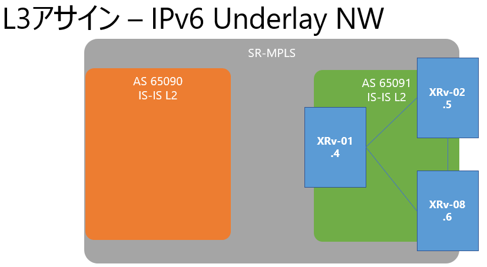

# SR-MPLS + SRv6 Environment
AS 65091の環境をSRv6へ変更し、Multi AS環境ともに構築できるか検証。

## Network Diagram

### SRv6 & IPv6 Assignment
- Locator: `NoX`
- Node SID: `fd00:x:x::/64`
- Loopback: `fd00:x:x::x/128`
- Inter AS: `fd00:xx::x/64`
- End Function:
  * UG-A: End.DT4 (per-vrf)
  * UG-B: End.DX4 (per-ce)
  * UG-C: End.DT4 (per-vrf)

